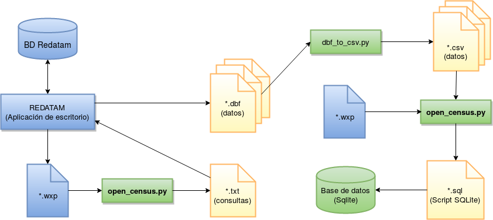

# Open Census - Framework para extraer y procesar datos censales presentes en bases Redatam

Con el fin de facilitar el proceso de extracción y procesamiento de datos almacenados en bases Redatam, en el Laboratorio de EcoInformática se desarrolló un _framework_ o marco de trabajo que permite, dada una base de datos Redatam, extraer de forma masiva la información contenida en ellas, cambiar el formato de extracción a un formato de uso común e incorporar la información extraída a una base de datos relacional Sqlite. Se hace uso de _scripts_ (desarrollados usando Python 2.7.12) que se encuentran disponibles para su uso y descarga.

En la Figura 1 se muestra un diagrama general del _framework_ desarrollado. Cuenta con tres módulos los cuales se detallará su finalidad y uso a continuación.


**Figura 1.** Diagrama general del _framework_ desarrollado.

</br>

### 1.- Extracción masiva de datos. ###

Módulo dedicado a la extracción masiva de información censal de una base de datos Redatam. Este módulo permite generar un documento de texto plano (*.txt) que contiene una serie de consultas escritas en el lenguaje propio de Redatam y que, una vez ingresadas a Redatam, permitirá extraer los datos, para las diferentes entidades y variables existentes, en archivos *.dbf.


**Figura 2.** Diagrama del módulo de extracción masiva de una base de datos Redatam.

Para hacer uso de este primer módulo es necesario cargar la base de datos Redatam. Una vez realizado lo anterior, haciendo uso de la interfaz gráfica de Redatam es posible exportar el diccionario de la base de datos Redatam en formato ASCII. Esto genera un archivo con formato *.wxp que contiene la estructura de la base de datos, además de los nombres y propiedades de las entidades y variables presentes en ella. Este archivo es el documento de entrada o "input" que lee el _script_ de la solución propuesta y del cual, posteriormente, se podrán obtener una serie de archivos *.dbf.

El _script_ python denominado "open_census.py" permite, dado un archivo *.wxp de entrada, obtener una serie de consultas en lenguaje Redatam que son almacenadas en un archivo de texto plano formato *.txt. Estas consultas, una vez ejecutadas en Redatam, permitirán obtener los micro-datos para las diversas entidades y variables presentes a la base de datos.

Para hacer uso del _script_ se debe escribir en consola:

```bash
$ python open_census.py [nombre_archivo].wxp [ruta_carpeta_dbf*] [nivel_geo*]
```

Donde "[nombre_archivo]" corresponde al nombre del archivo en formato \*.wxp exportado de Redatam. "[ruta_carpeta_dbf\*]" Es la carpeta donde Redatam exportará los archivos \*.dbf (opcional, por defecto se exportarán en "C:/".) y "[nivel_geo\*]" es el nivel geográfico del cual se obtendrán los datos censales (opcional, por defecto es "MANZENT" que equivale al nivel de "Manzana Censal" en las bases de datos analizadas).


</br>

### 2.- Cambio de formato archivos obtenidos. ###

Módulo que se aplica en los casos cuando se requiere cambiar de formato a múltiples archivos *.dbf para convertirlos en archivos *.csv, como por ejemplo en los archivos extraídos en la sección anterior.


**Figura 3.** Diagrama del módulo de conversión de formato de archivos, considerando un “input” de archivos extraídos desde Redatam. (\*) Este _script_ requiere de la instalación del paquete python "dbfpy" (disponible en https://pypi.python.org/pypi/dbfpy/2.3.1).


Para hacer uso de la herramienta se debe escribir en consola lo siguiente:


```bash
$ python dbf_to_csv.py [carpeta_origen] [carpeta_destino]
```


Donde “[carpeta_origen]” corresponde a la carpeta donde existen los archivos *.dbf y “[carpeta_destino]” es la carpeta donde se almacenarán los archivos convertidos en formato *.csv.

</br>

### 3.- Incorporación a una base de datos relacional Sqlite. ###

Si existe la necesidad de importar estos datos extraídos a una base de datos Sqlite para realizar consultas SQL, se puede hacer uso de este módulo para generar un _script_ que crea una base de datos sqlite e importa los datos a las tablas correspondientes.


**Figura 4.** Diagrama del módulo de generación de _script_ para creación de base de datos Sqlite e incorporación de datos extraídos en formato *.csv.

Es decir, la estructura de ejecución es:

```bash
$ python open_census.py [nombre_archivo].wxp --script
```

Una vez obtenido el archivo “script.sql” se debe ejecutar en la consola de Sqlite para que cree la base de datos correspondiente.
